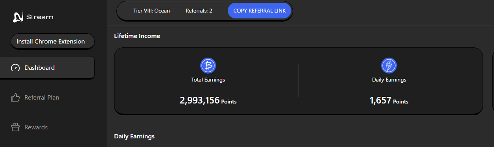
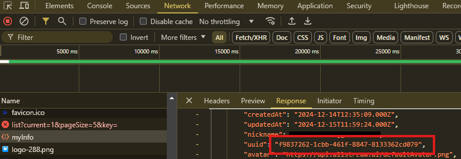

# AllStream Depin
Mine Data, Fuel AI, Earn Rewards Join the Stream AI Revolution


- Website [https://app.allstream.ai/](https://app.allstream.ai/index?referralCode=rIMzvTbW)
- Twitter/X [@allstream_ai](https://x.com/allstream_ai)

## Features

- **Auto Create Connections**
- **Support Multy Accounts**
- **Support Proxy** format `http://ip:port` or `http://username:password@ip:port`

## Requirements

- **Node.js**: Ensure you have Node.js installed.
- **NPM**: Ensure you have npm installed.
- **AiStream ID**: follow instructions below to get
- Create AiStream here : [https://app.allstream.ai/](https://app.allstream.ai/index?referralCode=rIMzvTbW)
- F12 to inspect if you already login
- find MyInfo from Network and copy your id.
   


## Setup

1. Clone this repository:
   ```bash
   git clone https://github.com/rmndkyl/streamAi-auto.git
   cd streamAi-auto
   ```
2. Install dependencies:
   ```bash
   npm install
   ```
3. Setup: Paste userId to `userIds.txt` 1 line 1 account
   ```bash
   nano userIds.txt
   ```
4. Setup: paste proxy to `proxies.txt` 1 line 1 proxy
   ```bash
   nano proxies.txt
   ```
5. Run The Script:
   ```bash
   npm run start
   ```

## ☕️ Traktir kopinya & Thanks for Supporting us:

- https://sociabuzz.com/layerairdrop/tribe
- https://saweria.co/LayerAirdrop
- https://trakteer.id/layerairdrop/tip
- **EVM : `0x3E0BD1156172c03E497157838f218CDF77Ab2885`**
- **SOLANA : `4DMvckFnSrm7fymVaPrXULrCq4h1yvfTWq5aHXLpLKsn`**

## 

This project is licensed under the [MIT License](LICENSE).


